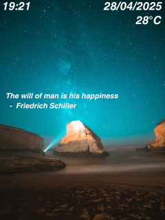

# FaceCheck-in-FreeRTOS-ESP32
FaceCheck-in FreeRTOS ESP32 Use FreeRTOS and 1.54 inch IPS LCD
> Version 1 available at: https://github.com/minh-le1710/FaceCheck-in
## RTOS Priority Task
| Task Name                 | Priority         | Core Affinity | Frequency / Trigger       | Notes                     |
|---------------------------|---------------------|---------------|--------------------------|---------------------------|
| MQTT Handler              | 4                 | Core 1        | On MQTT message (IRQ)    | Adafruit IO callback      |
| Buzzer & LED Control      | 3        | Core 0        | On event (semaphore)     | Non-blocking, short burst |
| Quote Update            | 2       | Core 0        | Every 1 hour (timer)        | Fetch daily quote via API    |
| Time & Weather Update     | 2               | Core 0        | Every 1 minute (timer)      | HTTP + NTP                |
| Display Update            | 1                | Core 1        | Every 1 s                   | Draw clock & status       |

## State
320*240 Resolution
| Dashboard            | Success         | Fail|
|---------------------------|---------------------|---------------|--------------------------|---------------------------|
|         |              |       | 

