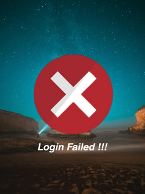

# FaceCheck-in-FreeRTOS-ESP32
FaceCheck-in FreeRTOS ESP32 Use FreeRTOS and 2.0 inch TFT LCD
> Main repo of project at: https://github.com/nguyentantai21042004/CO3109-Multidisciplinary_Project

> Version 1 available at: https://github.com/minh-le1710/FaceCheck-in
## RTOS Priority Task
| Task Name                 | Priority         | Core Affinity | Frequency / Trigger       | Notes                     |
|---------------------------|---------------------|---------------|--------------------------|---------------------------|
| MQTT Handler              | 4                 | Core 1        | On MQTT message (IRQ)    | Adafruit IO callback      |
| Buzzer & LED Control      | 3        | Core 0        | On event (semaphore)     | Non-blocking, short burst |
| Quote Update            | 2       | Core 0        | Every 1 hour (timer)        | Fetch daily quote via API    |
| Time & Weather Update     | 2               | Core 0        | Every 1 minute (timer)      | HTTP + NTP                |
| Display Update            | 1                | Core 1        | Every  1 minute                   | Draw clock & status       |

## State
> 320*240 Resolution

| Dashboard            | Success         | Fail |
|---------------------------|---------------------|---------------|
|         |              |       | 

## Getting Started with FaceCheck-in on PlatformIO

This guide explains how to clone the FaceCheck-in repository and build/upload it to your ESP32 using PlatformIO.

---

### Prerequisites

* **Git** (to clone the repository)
* **Visual Studio Code** (recommended)
* **PlatformIO IDE** extension installed in VS Code
---

### 1. Clone the Repository

Open a terminal and run:

```bash
# Clone the repo into a local folder
git clone https://github.com/minh-le1710/FaceCheck-in-ver2.git

# Change into the project directory
cd FaceCheck-in
```

---

### 2. Open in VS Code + PlatformIO

1. Launch **Visual Studio Code**.
2. Install the **PlatformIO IDE** extension if you haven’t already.
3. In VS Code, go to **File → Open Folder**, then select the cloned `FaceCheck-in` folder.

PlatformIO will detect the `platformio.ini` file and load the project.

---

### 3. Configure your Device

Edit `platformio.ini` if needed to match your board:

```ini
[env:esp32wrover]
platform = espressif32
board    = esp32doit-devkit-v1   ; 
framework= arduino

lib_deps =
  adafruit/Adafruit GFX Library
  adafruit/Adafruit ST7735 and ST7789 Library
  bblanchon/ArduinoJson
  knolleary/PubSubClient
```

---

### 4. Build & Upload

1. Connect your ESP32 to the PC via USB.
2. In VS Code, open the **PlatformIO** sidebar (alien icon).
3. Under **PROJECT TASKS → esp32wrover**, click **Build**. This will compile the firmware.
4. Once it succeeds, click **Upload** to flash the binary to your ESP32.

Alternatively, from the integrated terminal:

```bash
# Build
platformio run --environment=esp32wrover

# Upload
platformio run --target=upload --environment=esp32wrover
```

---

### 5. Monitor Serial Output

After uploading, you can view logs:

```bash
platformio device monitor --environment=esp32wrover
```

This opens the Serial Monitor at the default baud rate (115200).

---

You’re now running the FaceCheck-in firmware on your ESP32! It will connect to WiFi, subscribe to the Adafruit IO MQTT feed, and display check-in status on the ST7789 screen. If you have any questions or run into issues, please open an issue on the GitHub repository.

## Demo
[](https://youtu.be/JFucLhiPfvQ)
